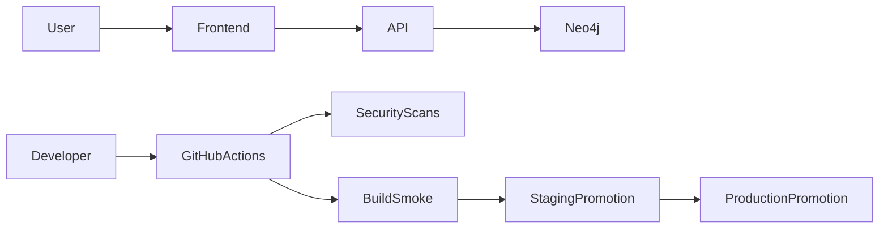

# TwinGraphOps

TwinGraphOps is a doc-driven digital twin demo that uses a FastAPI backend, a Neo4j graph store, an Express frontend, and a Grafana/Prometheus observability stack. This repo is structured so that the microservice application is intentionally simple, but the delivery workflow demonstrates automated build, test, security scanning, staged promotion, health checks, rollback planning, and a real AWS release path built from the same Docker Compose topology used for localhost development.

## Project Overview

TwinGraphOps models system dependencies in a knowledge graph so a user can:

- upload a structured `.md` or `.txt` system manual
- inspect graph relationships
- seed and query a simple digital twin
- extract graph nodes and edges with Gemini
- score graph nodes based on propagation risk
- verify service health and readiness
- observe minimal operational metrics during delivery validation

## Architecture Summary

The runtime stack in this repo is:

- `frontend`: Express UI for the upload/demo flow
- `api`: FastAPI service for Gemini-backed graph ingestion and query endpoints
- `neo4j`: graph database used as the digital twin store
- `prometheus`: metrics collector and alert rule evaluator
- `grafana`: dashboard UI for platform, ingest, and risk metrics



## DevSecOps Pipeline Summary

The repository uses GitHub Actions to model a deployment pipeline:

1. Developer pushes code or opens a pull request.
2. CI runs Python unit tests for the API and a dedicated frontend test suite.
3. CI performs a local Docker Compose build and smoke test for source validation.
4. Pushes to `twin-*` build the local `api` and `frontend` Docker images and run Trivy image scans against those local tags before smoke tests.
5. Pushes to `main` and `dev` also build `api` and `frontend` once, publish them to Amazon ECR with immutable `sha-<commit>` tags, and capture the resulting digest refs.
6. CI verifies:
   - API liveness: `/health`
   - API readiness: `/ready`
   - API metrics: `/metrics`
   - frontend health: `/healthz`
7. Security workflows run separately for:
   - secret scanning with Gitleaks
   - static analysis with CodeQL
   - filesystem vulnerability scanning with Trivy
8. Pushes to `main` and `dev` run Trivy image scans against the exact published digest refs after the publish step completes.
9. Pushes to `dev` run a **staging-like promotion** job using those same digest refs.
10. Pushes to `main` run a **production-like promotion** job gated by the GitHub `production` environment, again using those same digest refs.

GitHub branch protection is designed to mark the CI, Trivy, Gitleaks, and CodeQL workflows as required checks so the separate security workflows act as promotion gates.

## Environment Model

The project uses the same container topology across local development, CI validation, and AWS production. Local and CI still use Docker Compose directly, while production runs the cloud compose variant on EC2 and is deployed from tagged GitHub releases.

| Environment | Purpose | How it is represented |
| --- | --- | --- |
| `local` | developer workstation | `docker compose up --build` |
| `ci` | automated verification | GitHub Actions local validation plus exact-image smoke test |
| `staging` | pre-release promotion | `deploy-staging` workflow job |
| `production` | real cloud runtime | EC2 + Docker Compose + ECR + SSM |

The `TWIN_ENV` variable is injected into the services so environment state is visible in health responses and metrics.

## Security Controls Used

This project treats security as part of delivery, adopting the DevSecOps mindset of "shifting left" security controls into the CI/CD pipeline. The following table summarizes the security controls and their purpose.

| Control | Tool / Practice | DevSecOps purpose |
| --- | --- | --- |
| Secret detection | `secret-scan.yml` with Gitleaks | Prevent accidental credential commits |
| Static analysis | `codeql.yml` | Detect common code-level security issues |
| Filesystem vulnerability scanning | `trivy.yml` | Detect vulnerable packages in the source tree |
| Local and published image scanning | `.github/workflows/ci.yml` with Trivy | Scan local `twin-*` image builds before promotion and scan exact digest refs on `main`/`dev` |
| Secret isolation | `infra/secrets/*.txt` ignored in git | Keep operational credentials out of version control |
| Environment-based secrets | AWS Secrets Manager plus GitHub Actions OIDC | Keep GitHub out of long-lived secret storage while separating environments |

Confidentiality, integrity, and availability are addressed in a class-project form:

- Confidentiality: secrets are injected, not committed
- Integrity: code and infrastructure changes are versioned and validated through CI
- Availability: health checks, readiness checks, and staged promotion reduce broken deployments

## Infrastructure-as-Code 

This repo demonstrates the infrastructure-as-code mindset through committed delivery artifacts:

- `docker-compose.yml`: runtime topology, secrets, health checks
- `.github/workflows/ci.yml`: build, test, smoke, staging, production-like promotion
- `.github/workflows/trivy.yml`: vulnerability scanning
- `.github/workflows/secret-scan.yml`: secret scanning
- `.github/workflows/codeql.yml`: static analysis

These files are part of the system architecture because they define how software moves from code to a validated deployment state.

Additional AWS infrastructure is captured in:

- `infra/aws/ec2-compose-stack.yml`: single-host EC2 stack with SSM and ECR access
- `.github/workflows/release.yml`: tag-driven digest resolution, EC2 deployment, and GitHub release

## Health, Readiness, And Monitoring

Operational visibility is intentionally lightweight but explicit.

### API endpoints

- `GET /health`: liveness check
- `GET /ready`: readiness check against Neo4j
- `GET /health/neo4j`: dependency-specific health
- `GET /metrics`: Prometheus metrics payload with HTTP, dependency, Gemini, ingest, and graph summary metrics
- `POST /ingest`: upload a `.md` or `.txt` manual and extract a graph with Gemini
- `GET /graph`: return the active graph
- `GET /impact?component_id=<id>`: reverse dependency blast radius
- `GET /risk?component_id=<id>`: hybrid heuristic risk summary
- `POST /seed`: seed the demo graph

### Frontend endpoint

- `GET /healthz`: UI/service health response
- `GET /metrics`: frontend Prometheus metrics payload

### What the metrics show

The API exposes Prometheus counters, histograms, and gauges for:

- HTTP request totals, status codes, latency, and in-flight requests
- Neo4j dependency health and health-check latency
- Gemini request attempts, retries, timeouts, failures, and latency
- ingestion document counts, chunk counts, and failure counts
- graph node totals, edge totals, average risk, and risk bucket counts

The frontend exposes:

- request totals by route and status
- static asset response counts
- rate-limit hits
- uptime and environment labels

Grafana is provisioned with starter dashboards for:

- platform overview
- ingestion pipeline
- twin risk summary

### Logs

Runtime logs are available through Docker Compose:

```bash
docker compose logs api
docker compose logs frontend
docker compose logs neo4j
```

## Running The Project Locally

### 1. Create local secret files

Preferred: bootstrap them from AWS Secrets Manager so the repo keeps using `infra/secrets/*.txt` without making `.env` the source of truth.

Expected AWS secret JSON:

```json
{
  "neo4j_user": "neo4j",
  "neo4j_password": "replace-with-real-password",
  "gemini_api_key": "replace-with-real-api-key",
  "grafana_admin_user": "replace-with-real-admin-user",
  "grafana_admin_password": "replace-with-real-admin-password"
}
```

Bash:

```bash
bash ./infra/scripts/bootstrap-secrets-from-aws.sh your/local/secret-id
```

PowerShell:

```powershell
.\infra\scripts\Bootstrap-SecretsFromAws.ps1 -SecretId your/local/secret-id -Region us-east-1
```

Manual fallback:

```bash
bash ./infra/scripts/setup-local-secrets.sh
```

Requirements:

- AWS CLI installed
- an authenticated AWS session able to read the target secret
- a Secrets Manager secret whose `SecretString` is JSON with `neo4j_password`, `gemini_api_key`, `grafana_admin_user`, and `grafana_admin_password` keys (`neo4j_user` defaults to `neo4j`)

Required files:

- `infra/secrets/neo4j_auth.txt`
- `infra/secrets/neo4j_user.txt`
- `infra/secrets/neo4j_password.txt`
- `infra/secrets/gemini_api_key.txt`
- `infra/secrets/grafana_admin_user.txt`
- `infra/secrets/grafana_admin_password.txt`

### 2. Start the stack

```bash
docker compose up --build
```

### 3. Check the services

```bash
curl http://localhost:8000/health
curl http://localhost:8000/ready
curl http://localhost:8000/metrics
curl http://localhost:3000/healthz
curl http://localhost:3000/metrics

Open:

- Grafana: `http://localhost:3001`
- Prometheus: `http://localhost:9090`
```

Grafana now uses the secret-backed admin credentials from your local bootstrap or manual secret setup; there is no longer a hardcoded repo default login.

### 4. Upload a manual for extraction

The ingest pipeline accepts structured `.md` or `.txt` system manuals, chunks them, sends each chunk to Gemini for graph extraction, validates the JSON, writes the merged graph to Neo4j, and stores artifacts under `runtime/artifacts/`.

By default, each Gemini request is bounded by `GEMINI_TIMEOUT_MS=300000` inside the API so a blocked upstream call fails closed instead of leaving `/ingest` pending indefinitely.

That timeout is applied per Gemini request, not across the full ingest job. Because the backend sends one Gemini request per chunk, a 12-chunk upload can run much longer than 5 minutes overall as long as each individual request returns before its own timeout expires.

The document workspace now uses an async submit-and-poll flow: `POST /document/ingest` returns quickly with an `ingestion_id`, then the frontend polls `/document/ingest/{ingestion_id}/events` until the background job succeeds or fails before loading the document graph.

For larger manuals on a student/free-tier Gemini quota, the default runtime tuning now favors fewer timeouts without exploding request count:

- `GEMINI_MAX_CHARS=2400`
- `GEMINI_CHUNK_OVERLAP=200`
- `GEMINI_MAX_RETRIES=2`
- `GEMINI_RETRY_BACKOFF_SECONDS=1.0`

Example:

```bash
curl -X POST http://localhost:8000/ingest \
  -F "file=@api/examples/demo_system.md" \
  -F "replace_existing=true"
```

Then inspect:

```bash
curl http://localhost:8000/graph
curl "http://localhost:8000/impact?component_id=api"
curl "http://localhost:8000/risk?component_id=api"
```

## Test Coverage

The repo includes API unit tests and frontend tests so CI verifies more than container startup.

Run locally:

```bash
npm --prefix frontend ci --no-audit
npm --prefix frontend test

python -m pip install -r api/requirements.txt
python -m unittest discover -s api/tests -v
npm --prefix frontend test
```

The tests cover:

- frontend server endpoints such as `/healthz` and `/config.js`
- frontend route/page rendering for the upload, processing, and workspace views
- frontend upload validation behavior for unsupported and oversize files
- frontend API client error handling for malformed JSON, timeout, and network failures
- root endpoint contract
- readiness success path
- readiness failure behavior
- metrics output and request counters
- upload validation and Gemini ingest flow with mocks
- graph merge and heuristic risk scoring
- Gemini retry and validation behavior

## Deployment And Promotion 

TwinGraphOps now has a real production deployment path that builds directly on the localhost container model:

- localhost and CI keep using the existing Compose stack for fast validation
- pushes to `main` and `dev` publish immutable `sha-<commit>` images to Amazon ECR after local validation
- tagged releases resolve those previously published digest refs instead of rebuilding from source
- AWS Systems Manager tells the production EC2 host to pull those exact digest refs and restart `docker-compose.cloud.yml`
- the EC2 host loads Neo4j, Gemini, and Grafana credentials from AWS Secrets Manager at deploy time
- the EC2 host reads the production Gemini model from Systems Manager Parameter Store at `/twingraphops/production/gemini_model`

The production runtime is intentionally simple and budget-aware: one EC2 instance runs `nginx`, `frontend`, `api`, `neo4j`, `prometheus`, and `grafana`, which keeps the first cloud release inside a small-credit footprint while still being a real AWS deployment.

### Staging-like promotion

The `deploy-staging` job:

- uses GitHub Actions OIDC to assume an AWS role
- pulls the staging secret from AWS Secrets Manager into `infra/secrets/*.txt`
- starts the Compose stack with `TWIN_ENV=staging`
- verifies liveness, readiness, frontend health, metrics, and Grafana health
- records evidence in workflow logs

### Production release

The `TwinGraphOps Release` workflow is triggered by a version tag such as `v1.0.0` and:

- can only be started by pushing a `v*` tag; there is no manual arbitrary-ref production dispatch
- is tied to the GitHub `production` environment
- uses GitHub Actions OIDC to assume an AWS role
- runs API tests, frontend tests, and then builds the frontend
- resolves previously published `sha-<commit>` images from Amazon ECR into immutable digest refs
- optionally aliases those same digests to the release tag and `latest`
- deploys the tagged ref to the EC2 production host with AWS Systems Manager
- resolves the previous successful production release from GitHub release metadata before deploying
- verifies final health, readiness, and metrics checks on the instance
- automatically rolls back to the previous known-good digest refs if the production deployment fails
- publishes the GitHub Release after deployment succeeds

### GitHub Actions AWS configuration

The CI and release workflows expect these GitHub Actions variables:

- `AWS_REGION`
- `STAGING_AWS_ROLE_ARN`
- `STAGING_AWS_SECRET_ID`
- `PROD_AWS_ROLE_ARN`
- `PROD_AWS_SECRET_ID`
- `PROD_EC2_INSTANCE_ID`

Optional release variables:

- `PROD_API_ECR_REPOSITORY` default: `twingraphops-api`
- `PROD_FRONTEND_ECR_REPOSITORY` default: `twingraphops-frontend`

The staging and production jobs use `aws-actions/configure-aws-credentials` with OIDC, then run `infra/scripts/bootstrap-secrets-from-aws.sh` to write the existing secret files consumed by Docker Compose and the API.

Pushes to `twin-*` do not publish images; they only build local tags and run image vulnerability scans inside CI. Pushes to `main` and `dev` publish immutable `sha-<commit>` tags into the existing ECR repos and record the resulting digest refs in an `image-manifest` artifact.

Because those promotable images are published into the existing production ECR repositories, the CI publish path uses `PROD_AWS_ROLE_ARN` for ECR write access. The staging deployment simulation still uses `STAGING_AWS_ROLE_ARN`, so that staging role must be able to authenticate to ECR and pull from the shared API/frontend repositories.

At minimum, the staging role needs:

- `ecr:GetAuthorizationToken` on `*`
- `ecr:BatchCheckLayerAvailability` on the shared ECR repositories
- `ecr:BatchGetImage` on the shared ECR repositories
- `ecr:GetDownloadUrlForLayer` on the shared ECR repositories

The tagged release workflow uses the same OIDC model, resolves those previously published digest refs from ECR, and deploys the production host with `infra/scripts/deploy-ec2-compose.sh` and the `docker-compose.cloud.yml` topology. A production tag is therefore the approval boundary: it must point to a commit whose CI run already published promotable images.

The deploy script uses `GEMINI_MODEL` if it is provided explicitly. Otherwise, it reads `/twingraphops/production/gemini_model` from AWS Systems Manager Parameter Store and writes that value into the generated cloud env file before Docker Compose restarts the API.

All environment secrets now share the same JSON schema for `twingraphops/local`, `twingraphops/staging`, and `twingraphops/production`:

```json
{
  "neo4j_user": "neo4j",
  "neo4j_password": "replace-with-real-password",
  "gemini_api_key": "replace-with-real-api-key",
  "grafana_admin_user": "replace-with-real-admin-user",
  "grafana_admin_password": "replace-with-real-admin-password"
}
```

For the AWS bootstrap steps and CloudFormation template, see `infra/aws/README.md`.

## Rollback Procedure

Production rollback is now operationalized in two ways:

- each successful production release publishes `production-release-metadata.json` as a GitHub release asset
- that asset records the release tag, commit SHA, API digest ref, frontend digest ref, and deployment timestamp
- before a new production deploy starts, the workflow resolves the most recent prior release with that metadata asset
- if the new production deployment fails after the rollout command is sent, the workflow automatically redeploys that previous known-good API/frontend digest pair through the same `infra/scripts/deploy-ec2-compose.sh` path
- operators can also trigger the `TwinGraphOps Manual Rollback` workflow and supply a previous production release tag to redeploy that exact recorded digest pair on demand
- if no previous successful production release metadata exists yet, the workflow fails loudly instead of attempting a fake rollback

Operator follow-up stays simple:

1. Inspect the failed release job, automatic rollback job, or manual rollback job logs in GitHub Actions.
2. Confirm the rollback target release tag and digest refs shown in the workflow summary.
3. Verify the restored production instance:
   - `GET /healthz`
   - `GET /api/health`
   - `GET /api/ready`
   - `GET /api/metrics`
   - `GET /grafana/api/health`
4. If both deploy and rollback fail, investigate the EC2 host and rerun the manual rollback workflow with the last known-good release tag after fixing the root cause.

## Evidence Table

| DevSecOps requirement | Evidence in repo |
| --- | --- |
| Automated CI | `.github/workflows/ci.yml` |
| Build and smoke validation | `.github/workflows/ci.yml` |
| Secret scanning | `.github/workflows/secret-scan.yml` |
| Static analysis | `.github/workflows/codeql.yml` |
| Vulnerability scanning | `.github/workflows/trivy.yml` |
| Environment separation | `.github/workflows/ci.yml`, `docker-compose.yml` |
| Secret isolation | `.gitignore`, `infra/scripts/setup-local-secrets.sh`, `infra/scripts/bootstrap-secrets-from-aws.sh` |
| Health and readiness | `api/main.py`, `frontend/server.js` |
| Metrics visibility | `api/main.py` |
| Rollback automation | `.github/workflows/release.yml`, `.github/workflows/manual-rollback.yml`, `infra/scripts/release_rollback.py`, `infra/tests/test_release_rollback.py` |
